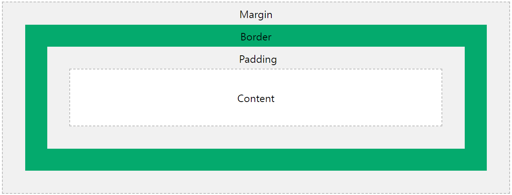

## 웹 사이트의 이해

### 웹을 구성하는 요소
`HTML`: 웹 사이트의 정보를 표기하고 그 구조를 설계<br />
`CSS`: 웹 사이트의 디자인과 스타일링<br />
`JavaScript`: 웹 사이트의 동적인 효과를 부여(슬라이드, 팝업 등)

### 웹 사이트 제작 시 고려 사항
1. **웹 표준**
   웹에서 요구하는 공식 표준이나 기술 규격을 만족하는 지 여부, 준수하면 구글에서 검색될 가능성이 높아진다.
2. **웹 접근성**
   장애 여부와 상관 없이 모두가 웹사이트를 이용할 수 있는 지 여부
3. **크로스 브라우징**
   모든 브라우저와 기기에서 웹사이트가 제대로 작동하는지 여부

```html
<!DOCTYPE html>               <!-- html5 문서를 선언 -->
<html>                        <!-- 문서의 시작과 끝 -->
  <head>                      <!-- 웹 사이트의 요약 정보 -->
    <meta charset="utf-8" />  <!-- 문자 코드를 위한 인코딩 방식 설정 -->
    <title>...</title>        <!-- 웹 사이트의 제목 설정 -->
  </head>
  <body>                      <!-- 눈에 보이는 정보, 출력되는 정보 -->
    ...
  </body>
</html>
```
> 몇몇 태그를 제외한 대부분의 태그들은 `</ >`형태의 닫힘 태그를 작성해야 한다.

<hr />

## HTML 태그의 상세

### HTML 기본 태그
HTML: HyperText Markup Language의 약어로, 웹 사이트에서 눈에 보이는 정보(텍스트, 이미지 등)나 특정 구역을 설정할 때 사용하는 언어.([HTML Reference](https://www.w3schools.com/tags/default.asp))

> `<TagName attributes="value"> Contents </TagName>`

#### 001. [``](https://www.w3schools.com/tags/tag_img.asp)
정보성을 가진 이미지를 삽입하는 열린 태그이다.
```html

```
- `src`: 삽입할 이미지 파일의 경로
- `alt`: 웹 사이트가 이미지를 출력하지 못한 경우 대체되는 텍스트(웹 접근성 고려)
- `width`, `height`: 이미지의 크기를 설정

#### 002. [`<h1> ~ <h6>`](https://www.w3schools.com/tags/tag_hn.asp)
Heading의 약자로 제목이나 부제목을 표현하는 태그로, 숫자가 작을수록 중요한 정보를 가지고 있으며, 따라서 fontSize가 커진다.
```html
<h1> Contents </h1>
```
주로 `<h1>`은 가장 중요한 정보를 담으므로 하나의 HTML 문서에서 한 번만 사용된다. 따라서 기업의 웹사이트에서는 다음과 같이 활용된다.
```html
<h1>
  <a>
    
  </a>
</h1>
```

#### 003. [`<p>`](https://www.w3schools.com/tags/tag_p.asp)
```html
<p> Contents <p>
```
Paragraph의 약자로 웹 사이트의 본문 내용, 중요 정보를 담을 때 활용하는 태그이다.

#### 004. [`<ul>`](https://www.w3schools.com/tags/tag_ul.asp)
Unordered List의 약자로, 순서가 없는 리스트를 생성하는 태그이다. 보통 아래와 같이 메뉴 버튼을 만들 때 사용된다.
```html
<ul>
  <li>menu 1</li>
  <li>menu 2</li>
  <li>menu 3</li>
</ul>
```
```html
<ul>
  <li><a href="#">menu 1</a></li>
  <li><a href="#">menu 2</a></li>
  <li><a href="#">menu 3</a></li>
</ul>
```

#### 005. [`<ol>`](https://www.w3schools.com/tags/tag_ol.asp)
Ordered List의 약자로, 순서가 존재하는 리스트를 생성하는 태그이다. 리스트 형식으로 표기된다.
```html
<ol>
  <li>menu 1</li>
  <li>menu 2</li>
  <li>menu 3</li>
</ol>
```

#### 006. [`<a>`](https://www.w3schools.com/tags/tag_a.asp)
Anchor의 약자로, 링크를 연결하는 태그이다. 기본값으로, 파란색 글씨와 밑줄이 부여된다.
```html
<a href="path" target="how"> Contents </a>
```
- `href`: 연결할 주소
- `target`: 해당 주소를 여는 방식 설정

### 구조를 설정하는 태그
이러한 구조를 설정하는 태그들은 대다수 `HTML5`에서 등장했기 때문에 [`!Doctype`](https://www.w3schools.com/tags/tag_doctype.asp)으로 선언된 HTML 문서에서만 활용할 수 있다.

#### 001. [`<header>`](https://www.w3schools.com/tags/tag_header.asp), [`<nav>`](https://www.w3schools.com/tags/tag_nav.asp)
`<header>` 태그는 웹 사이트의 머리글을 담는 공간으로, 보통 가장 먼저 보여지는 것을 작업한다. 또한, 일반적으로 내부에 `<nav>` 태그(navigation)를 통해 메뉴 버튼을 담는 공간을 구성한다. 이때 주로 `<nav>` 태그 내에는 `<ul>`, `<li>`, `<a>` 태그들이 존재한다.
```html
<header>
  <nav>
    ...
  </nav>
</header>
```
```html
<header>
  
  <nav>
    <ul>
      <li><a href="#">Home</a></li>
      <li><a href="#">About Me</a></li>
      <li><a href="#">Skills</a></li>
      <li><a href="#">Projects</a></li>
      <li><a href="#">Contact Me</a></li>
    </ul>
  </nav>
</header>
```

#### 002. [`<main>`](https://www.w3schools.com/tags/tag_main.asp), [`<article>`](https://www.w3schools.com/tags/tag_article.asp)
`<main>` 태그는 문서의 주요 내용을 담는 태그로, IE는 미지원하므로 `role="main"` 속성을 필수적으로 입력해야 한다.<br />
`<article>` 태그는 문서의 주요 이미지나 텍스트 등의 정보를 담고 구역을 설정하는 태그로, 태그 내 구역을 대표하는 타이틀 `<h1> ~ <h6>` 태그가 존재해야만 한다.(웹 표준)
```html
<main role="main">
  <article>
    ...
  </article>
  
  <article>
    ...
  </article>
</main>
```

#### 003. [`<footer>`](https://www.w3schools.com/tags/tag_footer.asp)
`<footer>` 태그는 가장 하단에 들어가는 정보들을 표기할 때 사용하는 태그로, 아래와 같이 활용된다.
```html
<footer>
  <div>
    <p>주소</p>
    <p>이메일</p>
    <p>전화번호</p>
  </div>
  <div>
    <p>사업자등록번호</p></p>
    <p>통신판매업 신고번호</p>
  </div>
</footer>
```

#### 004. [`<div>`](https://www.w3schools.com/tags/tag_div.asp)
`<div>` 태그는 임의의 공간을 만들 때 사용하는 태그이다.

### HTML 태그의 두 가지 성격
Block Elements와 Inline Elements는 줄 바꿈 현상이 있는지, 공간에 대한 크기를 만들어낼 수 있는지, 수직적으로 배치 작업이 가능한지 여부에 따라 구분된다.

#### Block Elements
```html
<p>Hello World</p>
<p>Hello World</p>
<p>Hello World</p>

> Hello World
> Hello World
> Hello World
```
Block Elements인 `<p>`, `<h1>` 등의 태그는 아래로 줄 바꿈되며 y축 정렬 형태로 출력된다. 따라서 공간을 만들 수 있어 `width`, `height` 속성을 설정할 수 있고, 수직적인 배치 작업이 가능하다.
즉, 공간의 구성을 설정하는 태그들은 모두 Block Elements이다.

#### Inline Elements
```html
<a>Hello World</a>
<a>Hello World</a>
<a>Hello World</a>

> Hello World Hello World Hello World
```

Inline Elements인 `<a>`, `<span>` 등의 태그는 한 줄로, 즉 x축 정렬 형태로 출력된다. 따라서 공간을 만들 수 없고, 수직적인 배치 작업이 불가능하다.

<hr />

## CSS

### CSS 정의
Cascading Style Sheet의 약어로, 색상, 공간 크기, 레이아웃 배치 작업 등 웹 사이트에 대한 디자인을 담당하는 언어로, HTML로 작성된 정보를 꾸며준다.

> `Selector { Property : Value; }`

- Selector: 디자인을 적용할 HTML 영역으로 태그명, id 혹은 class 등으로 구성된다.
- Property: `color`, `font-size`, `background-color` 등 어떤 디자인을 적용할 지를 정의한다.
- Value: `red`, `100px`, `40%` 등 해당 디자인에서 어떤 값을 적용할 지를 구체적으로 명령한다.

```css
h1 {
  /* Property: Value; */
  font-size: 20px;
  font-family: sans-serif;
  color: blue;
  background-color: yellow;
  text-align: center;
}
```

### CSS 적용 방식
1. **Inline Style Sheet**<br />
   HTML 문서 내부의 태그 안에 `style` 속성(Attributes)를 활용해 직접 원하는 스타일을 적용한다.
   ```html
   <h1 style="color: red;">Inline Style Sheet</h1>
   ```
2. **Internal Style Sheet**<br />
   HTML 문서 내부의 `<head>` 태그 내에 `<style>` 태그를 활용하여 원하는 스타일을 적용한다.
   ```html
   <head>
     <style>
       h1 { background-color: yellow; }
     </style>
   </head>
   ```
3. **External Style Sheet**<br />
   HTML 문서 외부에 작성된 CSS 파일(확장자 `.css`)을 `<head>` 태그 내부에서 `<link>` 태그를 활용해 연결하여 원하는 스타일을 적용한다.
   ```html
   <head>
     <link rel="stylesheet" href="style.css" />
   </head>
   ```

HTML 문서와 CSS 문서가 따로 분리되어 관리할 수 있어 상대적으로 가독성이 높고 유지보수가 쉽기 때문에 **External Style Sheet**를 주로 활용한다.

### CSS Selector
HTML의 어떤 요소에 CSS를 적용할 것인지에 대한 규칙이다.
1. **Type Selector**<br />
   특정 태그에 스타일을 적용한다.
   ```css
   h2 { color: red; }
   ```
2. **Class Selector**<br />
   Class 이름을 가진 요소에 스타일을 적용한다.
   ```css
   .className { color: blue; }
   ```
3. **ID Selector**<br />
   ID를 가진 요소에 스타일을 적용한다.
   ```css
   #idName { color: green; }
   ```

### CSS 부모 자식 관계
```html
<header>
  <h1>Header h1</h1>
  <p>Header p</p>
</header>

<footer>
  <h1>Footer h1</h1>
  <p>Footer p</p>
</footer>
```
위 예시에서 `<header>`와 `<h1>`, `<p>`는 부모 자식 관계이고, `<h1>`, `<p>`는 형제 관계이다. 이때 `<header>`에 적용된 CSS 스타일은 자식 관계에 있는 `<h1>`, `<p>`의 두 태그에도 상속된다.(참고로, 모든 속성이 상속되지는 아니한다. 또한, 다른 스타일이 직접 적용되는 경우 상속받은 스타일에 우선한다.)

또한, CSS를 적용할 때 원하는 지역의 해당 태그에만 스타일을 적용하기 위해 부모 태그를 공백으로 구분하여 구체적으로 표기할 수 있다.
```css
header { color: red; }
header h1 { color: blue; }
header p { color: green; }
```

### CSS 속성의 상속
```html
<!DOCTYPE html>
<html>
<head>
  <style>
    header h2 { color: blue; }
    header p { color: red; }
    footer h2 { color: black; }
    footer p { color: green; }
  </style>
</head>
<body>
  <header>
    <h2>Header H2</h2>      <!-- blue -->
    <p>Header P</p>         <!-- red -->
  </header>
  <footer>
    <h2>Footer H2</h2>      <!-- black -->
    <p>Footer P</p>         <!-- green -->
  </footer>
</body>
</html>
```

### Cascading
> `!important` > HTML inline `style` > `id` > `class` or `pseudo-class` > `tagName` > 상속된 CSS

CSS의 우선순위를 `Cascading`이라 부른다.
1. 순서에 의한 Cascading<br/>
   나중에 적용된 CSS의 우선순위가 높다.
   ```css
   p { color: red; }
   p { color: blue; }
   ```
2. 디테일에 의한 Cascading<br/>
   더 구체적으로 작성된 선택자의 우선순위가 높다.
   ```css
   header p { color: red; }
   p { color: blue; }
   ```
3. 선택자에 의한 Cascading<br/>
   style 속성 > id > class > type 순으로 우선순위가 높다.
   ```html
   <h3 style="color: pink;" id="color" class="color">H3</h3>
   ```
   ```css
   #color { color: blue; }
   .color { color: red; }
   h3 { color: green; }
   ```

### CSS 주요 속성
1. `width`, `height`<br/>
   선택한 요소의 너비와 높이를 설정하는 속성으로 고정값 `px`와 가변값 `%`(부모가 기준) 등의 단위를 활용한다.
   ```css
   div {
     width: 100px;
     height: 50%;
   }
   ```
2. `font`<br/>
   글꼴에 대한 설정을 하는 속성이다.
   - `font-family`의 경우 입력한 대로 우선순위가 적용된다.
   - `font-weight`의 경우 `keyword` 혹은 `100 ~ 900`을 속성 값으로 갖는다.
   ```css
   .paragraph {
     font-size: 50px;
     font-family: Arial, sans-serif;
     font-style: italic;
     font-weight: bold;
   }
   ```
3. `border`<br/>
   테두리에 대한 설정을 하는 속성이다.
   - `border-style`: 테두리 선의 종류를 설정(`solid`, `dotted` 등)
   - `border-width`: 테두리의 굵기를 설정
   - `border-color`: 테두리의 색상을 설정
   - `border` 단축 속성으로 설정할 수도 있다.
   ```css
   .paragraph {
     width: 500px;
     height: 500px;
     border-style: solid;
     border-width: 10px;
     border-color: red;
     /* border: solid 10px red; */
   }
   ```
4. `background`<br/>
   특정 영역에서 배경에 대한 설정을 하는 속성이다.
   - `background-color`: 배경 색상을 설정
   - `background-image`: 배경 이미지를 설정
   - `background-repeat`: 배경 이미지의 반복 효과를 설정
   - `background-position`: 특정 공간 내부의 이미지의 좌표를 설정(`top`, `bottom`, `center` 등)
   ```css
   .paragraph {
     width: 500px;
     height: 500px;
     background-color: yellow;
     background-image: url(path);
     background-repeat: no-repeat;
     background-position: left;
     /* background: yellow url(path) no-repeat left; */
   }
   ```

<hr />

## 웹 사이트 레이아웃에 영향을 미치는 요소
### [**Box Model**](https://www.w3schools.com/css/css_boxmodel.asp)
<br/>
`border`를 기준으로 외부 여백은 `margin`, 내부 여백은 `padding`이 된다.
```css
div {
  /* top right bottom left 순서 */
  margin: 100px 0 0 100px;
  padding: 30px 20px 25px 20px;
}
```
`padding`을 활용해 배치를 변경하는 경우, 전체 크기가 변할 수 있음에 유의해야 한다.

### **Block & Inline**
1. Block Elements<br/>
   `<p>`, `<h1> ~ <h6>`, `<div>`, `<header>` 등의 태그와 같이 줄 바꿈 현상이 발생하고, `width`, `height` 값을 사용해 공간을 만들 수 있으며 `margin`, `padding` 값을 사용해 상하 배치 작업이 가능한 요소를 Block Element라고 한다.

2. Inline Elements<br/>
   `<a>`, `<span>` 등의 태그와 같이 줄 바꿈 현상이 없고, `width`, `height` 값을 활용할 수 없으며, `margin-top`, `margin-bottom`, `padding-top`, `padding-bottom`을 활용할 수 없어 상하 배치 작업이 불가능한 요소를 Inline Elements라고 한다.


### **`margin` 병합 현상**
1. 형제지간의 `margin` 병합<br/>
   ```html
   <div class="box1">1</div>
   <div class="box2">2</div>
   ```
   ```css
   .box1 { margin-bottom: 150px; }
   .box2 { margin-top: 100px; }
   ```
   `margin-bottom`과 `margin-top` 중 더 큰 값으로 적용된다.

2. 부모지간의 `margin` 병합<br/>
   ```html
   <main role="main">
     <article></article>
   </main>
   ```
   ```css
   article {
     width: 200px;
     height: 200px;
     margin-top: 100px;
   }
   ```
   `<article>` 뿐만 아니라 부모인 `<main>`에도 영향을 미친다. 이때 `<article>`, 즉 자식 요소에 `position` 속성을 `absolute`로 설정하면 `margin` 병합을 해소할 수 있다.

### **레이아웃에 영향을 미치는 속성**
1. `display`<br/>
   Block Elements와 Inline Elements의 성격을 바꿀 때 사용한다. `inline-block`을 활용하면 두 요소의 성격을 모두 가질 수 있다.
   ```css
   p { display: inline; }
   a { display: block; }
   a { display: inline-block; }
   ```
2. `float`<br/>
   이름 그대로 요소를 띄워 새로운 레이어 층을 만드는 것이다. 이는 선택한 요소를 좌우측에서부터 정렬시키고자 할 때 사용한다. 즉, 연속적으로 `float`을 `left` 값을 부여하면 좌측 정렬이 된다. 다만, 부모 요소의 `width`에 따라 좌우측 정렬이 정해진다.(만약 두 자식 요소보다 너비가 작다면 레이아웃이 틀어지게 된다.)
   ```css
      .left { float: left; }
   .right { float: right; }
   ```
3. `clear`<br/>
   `float`에 대한 속성을 제어하고자 할 때 사용한다. 이는 마지막으로 `float` 속성을 활용한 요소 이후의 요소에 삽입한다.
   ```html
   <header></header>
   <aside class="left">Hello</aside>
   <main></main>
   <aside class="right">World</aside>
   <footer></footer>
   ```
   ```css
   .left { float: left; }
   .right { float: right; }
   footer { clear: both; }
   ```
4. 브라우저와 공간 사이의 공백 제거하기<br/>
   기본적으로 `<html>`, `<body>` 태그는 `margin`, `padding`을 가지고 있어 초기화해주어야 한다.
   ```css
   html, body {
     margin: 0;
     padding: 0;
   }
   ```
   혹은 `*` 선택자를 활용해 모든 태그를 선택한 후 초기화해줄 수 있다.
   ```css
   * {
     margin: 0;
     padding: 0;
   }
   ```