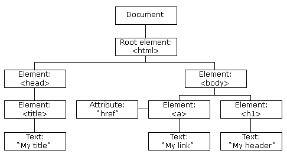

## JavaScript DOM과 Event
### DOM
#### DOM의 정의
DOM은 문서 객체 모델, 즉 Document Object Model의 약어로, 객체 지향 모델로써 구조화된 문서를 표현하는 형식으로 프로그래밍 언어가 문서 구조, 스타일 내용 등을 변경할 수 있도록 하는 인터페이스를 의미한다. DOM은 프로그래밍 언어와 독립적으로, 주로 JavaScript를 활용하지만, 다른 언어에서도 구현 가능하다.

HTML DOM은 HTML 문서의 프로그래밍 인터페이스를 제공한다. 즉, HTML 문서를 조작하고 접근하는 표준화된 방법으로, 모든 HTML 요소는 HTML DOM을 통해 접근이 가능하다.

이러한 DOM은 보통 트리 구조 갖고 있다.


#### `Document` 객체
웹 페이지 자체를 의미하는 것으로, 해당 웹 페이지 내에 존재하는 HTML 요소에 접근하고자 할 때는 반드시 `Document` 객체부터 시작해야 한다. 이러한 `Document` 객체는 HTML 요소에 대한 여러 Method를 제공한다.(요소 선택 및 생성, 객체 선택, 이벤트 핸들러 추가 등)

#### HTML 요소를 선택하기 위한 Method
[참고 자료 - 선택자로 DOM 요소 선택하기](https://developer.mozilla.org/ko/docs/Web/API/Document_Object_Model/Locating_DOM_elements_using_selectors)
##### [`document.getElementById()`](https://developer.mozilla.org/ko/docs/Web/API/Document/getElementById)
해당 Id의 HTML 요소를 선택
> let element = document.getElementById("id");

##### [`document.getElementByClassName()`](https://developer.mozilla.org/ko/docs/Web/API/Element/getElementsByClassName)
해당 Class의 첫 HTML 요소를 선택
> let element = element.getElementByClassName("class");

##### [`document.getElementByTagName()`](https://developer.mozilla.org/ko/docs/Web/API/Document/getElementsByTagName)
해당 Tag의 첫 HTML 요소를 선택
> let element = document.getElementByTagName("tag");

##### `document.getElementByName()`
해당 `name` 속성 값의 HTML 요소를 선택
> let element = document.getElementByName("name");

##### [`document.querySelectorAll()`](https://developer.mozilla.org/ko/docs/Web/API/Document/querySelectorAll)
해당 CSS 선택자로 선택할 수 있는 모든 HTML 요소를 선택(배열로 반환)
> let elementList = parentNode.querySelectorAll("selectors");

`Document.querySelectorAll()`는 지정된 선택자 그룹과 일치하는 HTML 요소의 배열을 나타내는 NodeList를 반환한다.

##### [`document.querySelector()`](https://developer.mozilla.org/ko/docs/Web/API/Document/querySelector)
해당 CSS 선택자로 선택할 수 있는 첫 HTML 요소를 선택
> let element = document.querySelector("selectors");

`Document.querySelector()`는 제공한 선택자 또는 선택자 그룹과 일치하는 HTML 문서 내 첫 번째 요소를 반환하고, 일치하는 요소가 없으면 `null`을 반환한다.

#### HTML 요소의 스타일 변경
스타일을 변경할 HTML 요소를 선택하고, 해당 요소의 `style` 속성 내 특정 속성에 대한 속성 값을 변경하면 된다.
```javascript
let element = document.querySelector(".lightMode");

element.style.color = "white";
```

#### HTML 요소의 내용 변경
내용을 변경할 HTML 요소를 선택하고, 해당 요소의 [`innerHTML`](https://developer.mozilla.org/ko/docs/Web/API/Element/innerHTML), [`textContent`](https://developer.mozilla.org/ko/docs/Web/API/Node/textContent), [`innerText`](https://developer.mozilla.org/ko/docs/Web/API/HTMLElement/innerText)에 접근하여 변경할 수 있다.
```javascript
let element = getElementByClassName("darkMode");

element.innerHTML = "Dark Mode";
```

#### Node 객체
##### Node의 정의
HTML DOM에서 정보를 저장하는 계층적 단위로, 이들의 집합을 Node Tree(노드 트리)로 표현하고 노드간의 관계를 나타낸다. HTML DOM을 활용해 Node Tree에 포함된 모든 Node에 접근할 수 있다.

Node Tree의 모든 Node는 서로 계층적인 관계를 맺고 있다. 즉, 부모-자식 관계 혹은 형제 관계를 가지고 있다.

##### Node의 종류
- 문서 Node: HTML 문서 전체를 나타내는 Node
- 요소 Node: 모든 HTML 요소는 요소 Node로, **속성 Node를 가질 수 있는 유일한 Node**이다.
- 주석 Node: HTML 문서의 모든 주석을 나타내는 Node(사용도가 매우 낮음)
- 속성 Node: 모든 HTML 요소의 속성은 속성 Node로, 요소 Node에 관한 정보를 갖고 있다. 다만, 해당 요소 Node의 자식 Node에는 포함되지 않는다.
- 텍스트 Node: HTML 문서의 모든 텍스트를 나타내는 Node(자식 요소가 될 수 있다.)

##### Node 조회
`nodeName`, `nodeValue`, `nodeType`의 Property를 통해 Node에 대한 정보를 조회할 수 있다. 다만, `nodeType`의 경우 텍스트가 아닌 숫자를 반환한다.
```javascript
// HTML 문서의 모든 자식 Node 중 첫 번째 Node의 이름
document.childeNodes[0].nodeName;

// Id가 "heading"인 요소의 첫 번째 자식 Node의 값
document.getElementsById(".heading").firstChild.nodeValue;

// Id가 "heading"인 요소의 첫 번째 자식 Node의 타입
document.getElementsById(".heading").firstChild.nodeType;
```
```javascript
// nodeType 값의 의미
요소 노드: 1
속성 노드: 2
텍스트 노드: 3
주석 노드: 8
문서 노드: 9
```
- `childeNodes`: 자식 Node 조회
- `firstChild`: 첫 번째 자식 Node 조회

#### HTML 요소를 생성하기 위한 Method
##### `document.createElement()`
지정된 HTML 요소를 생성
##### `document.write()`
HTML 출력 스트림을 통해 텍스트를 출력(웹 페이지에 출력)

#### HTML 요소에 이벤트 핸들러를 추가하기 위한 속성
##### `Element.onclick = function() {}`: 마우스 클릭 이벤트에 연결

### Event
#### Event의 정의
웹 브라우저가 알려주는 HTML 요소에 대한 사건의 발생을 의미하며, JavaScript는 Event에 반응해 특정 동작을 수행하게 된다. 예를 들어, 마우스를 클릭하거나 이동하거나 키보드를 누르는 등의 모든 사건이 Event가 된다.

#### Event type
발생한 Event의 종류는 매우 다양하다.(폼, 키보드, 마우스, HTML DOM, Window 객체 등)
```html
<p onclick="changeText(this)">Click me!</p>

<script>
  function changeText(element) {
    element.innerHTML = "Do Not Click Me!";
  }
</script>
```

#### Event Handler
Event가 발생했을 때 동작을 담당하는 함수를 의미한다. 지정된 특정 Event가 발생하면, 웹 브라우저는 그 요소에 등록된 Event Handler를 실행시켜 특정 동작을 수행하게끔 한다.
```javascript
// Event Handler 등록 방법 1: JavaScript 코드로 등록하기

// HTML 문서가 로드되는 Event에 대한 Event Handler
window.onload = function() {
  let text = document.getElementById("text");
  text.innerHTML = "HTML Document is loaded."
}
```

```html
<!-- Event Handler 등록 방법 2: HTML 태그에 속성 값으로 등록하기 -->

<button onclick="this.innerHTML = 'Goooooooooood!'">Click Me!</button>
```

```javascript
// Event Handler 등록 방법 3: JavaScript addEventListener() 활용하기
let $btn = document.getElementById("주문하기");

$btn.addEventListener("click", function () {
  document.querySelector(".result_text").innerHTML = "해당 상품을 주문하시겠습니까?";
});
```

### JavaScript Practice
#### 내비게이션 구현에 필요한 기능
- `e.preventDefault();`: Event Handler에서 현재 Event의 기본 기능, 동작을 정지시키는 Method
- `.getAttributes("attribute");`: 해당 태그가 보유한 속성의 속성 값을 가져온다.
- `window.scrollTo({'top':..., 'behavior': ..., }})`: 특정 영역의 좌표값(`tag.offsetTop`: 선택된 영역의 상단까지의 거리를 절대 좌표로 반환하는 Method)으로 어떤 식으로 스크롤링할 것인지를 설정한다.

#### 이미지 자동 슬라이드 구현에 필요한 기능
- `setInterval(function() {}, 3000);`: 해당 함수를 3초(`3s` = `3000ms`)간격으로 반복적으로 실행하는 함수.
- `.animate({ 적용할 속성: [from 값, to 값]}, { animation 속성(duration, easing, iterations, fill 등)})`: 선택한 태그에게 애니메이션을 설정하는 Method

#### 탭 버튼 구현에 필요한 기능
- `.classList.remove("className");`: 선택한 요소에서 특정한 클래스를 제거하는 Method.
- `.classList.add("className");`: 선택한 요소에서 특정한 클래스를 추가하는 Method.
- `nodeList.forEach(function(item) { console.log(item); });`: 배열 모든 요소에 대해 콜백 함수를 실행하는 Method.

#### 이미지 수동 슬라이드 구현에 필요한 기능
- `.previousElementSibling;`: 이전 형제 Node 선택
- `.nextElementSibling;`: 다음 형제 Node 선택
- `.parentElement;`: 부모 요소 선택
- `.firstElementChild;`: 첫 번째 자식 요소 선택
- `.lastElementChild;`: 마지막 자식 요소 선택