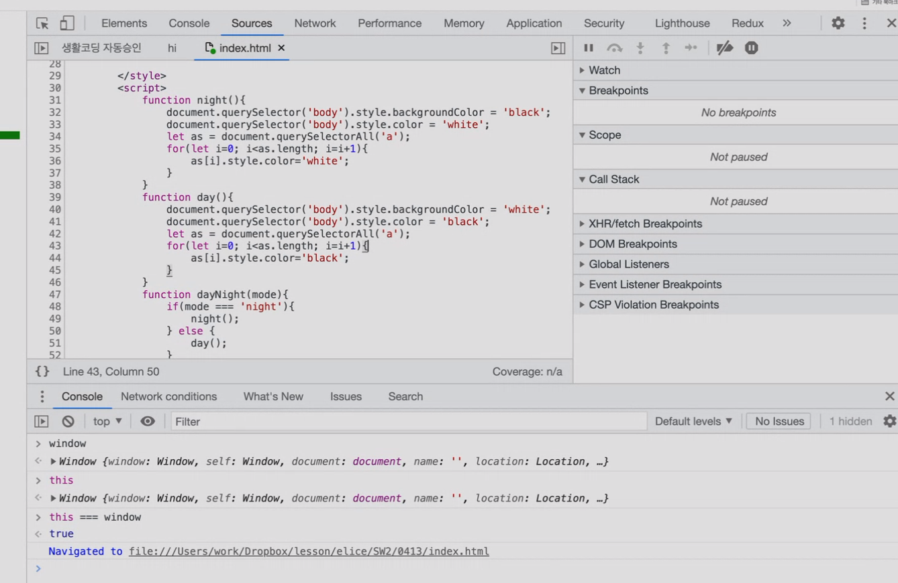

## Modern JavaScript
### Review
- [Snippets](https://ko.wikipedia.org/wiki/%EC%8A%A4%EB%8B%88%ED%8E%AB)<br />
  재사용 가능한 소스 코드, 기계어, 텍스트의 작은 부분을 의미하며, 사용자가 루틴 편집 조작 중 반복 타이핑을 회피할 수 있게 도와준다. 브라우저 Console에서 하는 작업의 휘발성 문제를 대체할 수 있는 방안이다.
- `FileSystem` 탭의 `Add folder to workspace` 기능을 통해 브라우저 Console에서도 로컬에서 작업중인 디렉토리를 선택해 편집하고, Debug를 할 수도 있다.
- 이고잉 코치님: 개인적인 프로젝트를 하다보면 결국 성장할 수 있다. 보편적인 프로젝트는 일생에 한 두개 할 수 있다. 즉, 개인적인 프로젝트를 통해 실력을 쌓고, 보편적인 프로젝트의 주제를 깨달을 수도 있고 쌓은 실력을 통해 다른 보편적인 프로젝트에 참여할 수 있는 기회를 얻을 수도 있다.
- breakpoint: 해당 지점에서 코드의 진행을 일시 중단시키는 기능.
- **Console에서 Call Stack, Scope 등을 확인할 수 있고, Debug를 활용할 수 있다.(자주 활용할 것)**
  

### [jQuery CDN](https://releases.jquery.com/)
[CDN](https://www.akamai.com/ko/our-thinking/cdn/what-is-a-cdn)([콘텐츠 전송 네트워크](https://library.gabia.com/contents/infrahosting/8985/))은 지리적으로 분산된 여러 개의 서버로, 웹 콘텐츠를 사용자와 가까운 곳에서 전송함으로써 전송 속도를 높인다. 보통 개발할 때는 uncompressed 버전을 활용하고, 배포할 때는 minified 버전을 활용한다.

```html
<script src="https://code.jquery.com/jquery-3.6.0.min.js" integrity="sha256-/xUj+3OJU5yExlq6GSYGSHk7tPXikynS7ogEvDej/m4=" crossorigin="anonymous"></script>
```
```javascript
$('body').css('background-color', 'black');  // jQuery 버전의 동일 코드
// document.querySelector('body').style.backgroundColor = 'black';

$('body').css('color', 'white');  // jQuery 버전의 동일 코드
// document.querySelector('body').style.color = 'white';
```

jQuery의 Chaining를 활용해 더 간결하고 추가적으로 더 작성할 수 있다.
```javascript
$('body').css('background-color', 'black').css('color', 'white');
```

jQuery는 반복문을 대체할 수 있다.
```javascript
$('a').css('color', 'white');

// 아래 javascript 코드와 동일함
// let as = document.querySelectorAll('a');
// for (let i = 0; i < as.length; i++) {
// as[i].style.color='white';
// }
```
다음 방식으로도 활용할 수 있다.
```html
<div id="target">toogle</div>
<input type="button" value="hide/show" onclick="$('#target').toggle();">
```

### CSS, JavaScript의 분할
하나의 함수나 스타일이 지속적으로 반복 활용되는 경우, **복사-붙여넣기**를 모두 할 수는 없다. 따라서 각각 기능에 따라 다른 하나의 CSS, JavaScript 파일로 변경하여 활용하면 더 간결하고 깔끔한 코드를 작성할 수 있고, 한 번만 불러와서 캐시에 저장하여 활용할 수 있기 때문에 더 좋은 성능을 기대할 수 있다.

먼저 `<head>` 태그 내에 `<link>` 태그와 `<script>` 태그를 활용해 연결할 수 있다.
```html
<link rel="stylesheet" href="./style.css">
<script src="./darkmode.js" defer></script>
```

다만, 이 경우 변수, 함수 등의 이름이 충돌할 수 있다. 예를 들어, 분할한 JavaScript 파일과 HTML 문서 내에서 작성된 `script` 태그 내용이 충돌하는 경우 문제가 생길 수 있다.

Node.js에서는 [`import`](https://caniuse.com/?search=import)와 [`export`](https://caniuse.com/mdn-javascript_statements_export)를 활용해 모듈을 불러와서 사용할 수 있다. 이와 동일하게 JavaScript에서도 활용할 수 있다.([사용해도 되는 지 파악하기](https://caniuse.com/))

#### [모듈 import, export](https://developer.mozilla.org/ko/docs/Web/JavaScript/Guide/Modules)
```javascript
export { yuanToWon, yenToWon };
export function dollarToWon(money) {
  var won = money * 1224.5;
  return won;
};
export default euroToWon;

import euroToWon from './exchange/euro.js'
import { dollarToWon } from './exchange/dollar.js'
import { yuanToWon, yenToWon } from './exchange/asia.js'
```
`default export`는 한 파일 당 한 번만 사용 가능하며, `import` 할 때 이름을 자유롭게 사용할 수 있다.

이와 달리 `named export`는 한 파일에서 여러 개를 `export`할 때 사용 가능하며, `import` 할 때와 `export` 할 때의 이름이 동일해야 한다.

이때 특정 function을 `export`하면, 해당 함수는 public function이 되고, 외부에서 불러와서 활용할 수 있게 된다.
```javascript
function dark(){
    document.querySelector('body').style.backgroundColor = 'black';
    document.querySelector('body').style.color = 'white';
    let as = document.querySelectorAll('a');
    for(let i=0; i<as.length; i=i+1){
        as[i].style.color='white';
    }
}
function light(){
    document.querySelector('body').style.backgroundColor = 'white';
    document.querySelector('body').style.color = 'black';
    let as = document.querySelectorAll('a');
    for(let i=0; i<as.length; i=i+1){
        as[i].style.color='black';
    } 
}
export function darkmode(mode){
    if(mode === 'night'){
        dark();
    } else {
        light();
    }
}
```
```html
<script>
  import {dayNight} from './darkmode.js';
</script>
```
이 경우 `SyntaxError`가 발생한다.(`Cannot use import statement outside a module.`) 따라서 script 태그의 `type` 속성을 `module`로 지정해주어야 한다.(* 반드시 웹 서버로 열어야 한다. [순서 관련 참고 자료 1](http://daplus.net/javascript-%EC%8A%A4%ED%81%AC%EB%A6%BD%ED%8A%B8-%EC%88%9C%EC%84%9C%EB%A1%9C%EB%93%9C-%EB%B0%8F-%EC%8B%A4%ED%96%89/) / [순서 관련 참고 자료 2](http://www.tcpschool.com/html-tag-attrs/script-defer)) 다만, 이 경우 module은 모든 웹 페이지 요소가 렌더링된 후에 실행되기 때문에 어디에 작성하는 지는 무관하다.(Executed Context: 실행 컨텍스트 [참고자료 1](https://www.zerocho.com/category/JavaScript/post/5741d96d094da4986bc950a0) / [참고자료 2](https://poiemaweb.com/js-execution-context) / [참고자료 3](https://gist.github.com/snaag/de92e29268429ada9da686125ac937e1))
```html
<script type="module">
  import {darkMode} from './darkmode.js';
</script>
```
즉, `import`를 통해 더욱 정교하게 모듈을 가져올 수 있다. 다만, `onclick`의 경우 모듈 밖이기 때문에 해당 함수를 활용할 수 없고, 에러가 발생한다. debugger를 사용해 확인해보면 해당 `<input>` 태그의  Scope에 `darkmode` 함수가 존재하지 않음을 확인할 수 있다. 따라서 `addEventListener`를 활용해야 한다.
```html
<script type="module">
  import {darkMode} from './darkmode.js';
  document.querySelector("#darkModeBtn").addEventListener("click", darkMode);
</script>
```

### 이벤트 핸들러 추가
이벤트 핸들러를 추가하기 위해서는 콜백 함수를 사용한다. 시스템이 호줄하는 나중에 실행되기로 약속된 함수를 콜백 함수(Callback Function)이라고 한다. 콜백 함수의 매개변수로 `event` 객체를 불러올 수 있다. 이는 해당 태그에 발생한 이벤트에 대한 정보를 가지고 있다.
```html
<input type="button" id="btn1" value="btn1" onclick="l()">
<input type="button" id="btn2" value="btn2" onclick="">
<script>
  function l() {
    alert("button!")
  }
</script>
```
```html
<input type="button" id="btn1" value="btn1" onclick="">
<input type="button" id="btn2" value="btn2" onclick="">
<script>
  function l() {
    alert("button!")
  }
  function l2(evt) {
    alert(evt.target.value)
  }
  document.querySelector("#btn1").addEventListener("click", l);
  document.querySelector("#btn1").addEventListener("click", l2);
  document.querySelector("#btn2").addEventListener("click", l);
</script>
```

### CRUD(Create Read Update Delete) by Vanilla JavaScript
기존의 `<a>`를 통해 페이지 링크를 활용하는 경우에는 하나의 웹 페이지를 추가할 때마다 과도한 노동이 동반된다. 만약 이것이 1억개의 웹 페이지를 가지고 있다면, 퇴사하고 싶어질 것이다. 따라서 게으르지만 유능한 개발자들은 하나의 웹 페이지를 변경하면 다른 1억개의 페이지가 모두 수정되기를 원한다.

|ID|제목|본문|
|:-:|:-:|:-:|
|1|HTML|HTML is..|
|2|CSS|CSS is...|
|3|JavaScript|JavaScript is...|

여기서 각각 행은 하나의 **개체, 관측치, 사례**이고, 각각의 열은 **속성, 변수, 특성, feature, field**을 의미한다.

이때 1행과 2행은 같은 성격을 가지므로 평등하고, 따라서 배열로 활용할 수 있다. 다만, 1열, 2열, 3열 즉, 각 속성은 성격이 다르기 때문에 배열로 활용할 수 없고, 이름도 존재해 객체에 담아 활용하는 것이 효과적이다.

```javascript
let title = ['HTML', 'CSS', 'JavaScript',];     // 2열 Data

// 배열로 나타낸 Data
let arrData = [
  [1, 'HTML', 'HTML is ...',],
  [2, 'CSS', 'CSS is ...',],
  [3, 'JavaScript', 'JavaScript is ...',],
]

// 객체로 나타낸 Data
let objData = [
  {id: 1, title: 'HTML', body: 'HTML is ...',},
  {id: 2, title: 'CSS', body: 'CSS is ...',},
  {id: 3, title: 'JavaScript', body: 'JavaScript is ...',},
];
```

#### 반복문과 `innerHTML` 활용
이후 해당 데이터의 개수만큼 `<li>`를 만들어야 한다. 우선 반복문과 `innerHTML`을 활용해 재사용 가능한 함수로 만들어보자.
```javascript
function nav() {
  for (let i = 0; i < objData.length; i++) {
    const $list = document.querySelector('#topics');
    $list.innerHTML += `<li> <a href="${objData[i].title}.html">${objData[i].title}</a></li>`;
  }
}

nav();

// 강의
const nav2 = function() {
  let navTag = '';
  for (let i = 0; i < objData.length; i++) {
    navTag += `<li><a href="/read/${objData[i].id}.html">${objData[i].title}</a></li>`;
  }

  document.querySelector("nav ol").innerHTML = navTag;
}

nav2();

const nav3 = () => {
  let navTag = '';
  for (let i = 0; i < objData.length; i++) {
    navTag += `<li><a href="/read/${objData[i].id}.html">${objData[i].title}</a></li>`;
  }

  document.querySelector("nav ol").innerHTML = navTag;
}

nav3();
```

#### 함수 생성 방식 3가지
`function fName() {}`: 기본 방식

`const fName = function() {}`: 변수 할당 방식

`const fName = () => {}`: 화살표 방식

#### [`Array.prototype.map()`](https://developer.mozilla.org/ko/docs/Web/JavaScript/Reference/Global_Objects/Array/map) 활용
`map` method는 원래 배열의 값을 map의 콜백 함수의 반환값으로 치환한다.
```javascript
function nav() {
  objData.map((e) => {
    const $list = document.querySelector('nav ol');
    $list.innerHTML += `<li><a href="${e.title}.html">${e.title}</a></li>`;
  })
}

nav();
```

#### `forEach()`, `map()`, `reduce()`
`forEach()`: return이 없다.(바로 변수에 할당하고 출력하면 `undefined`가 출력된다.)

`map()`: 각 요소에 대해 계산된 새로운 배열을 return으로 반환 받는다.([참고자료 - fill & map으로 배열 생성하기](https://velog.io/@minjae2271/Javascript-fill%EA%B3%BC-map%EC%9C%BC%EB%A1%9C-1%EB%B6%80%ED%84%B0-100%EA%B9%8C%EC%A7%80-%EB%B0%B0%EC%97%B4-%EC%83%9D%EC%84%B1%ED%95%98%EA%B8%B0))

`reduce()`: `current`, `previous` 등을 받아 계산하고 그 값을 반환한다.

```javascript
const factorial = (n) => {
  let arr = new Array(n).fill().map((e, i) => i + 1);

  const ans = arr.reduce((prev, curr) => {
    return prev * curr
  }, 1);

  return ans
}
```

#### `reduce()`와 [`concat()`](https://developer.mozilla.org/ko/docs/Web/JavaScript/Reference/Global_Objects/Array/concat)
```javascript
// Flatten Array
const GIVEN = [[4, 2, 3], [4, [3, 4, [5, 3]], 5], [4, 3, 5]];
const GIVEN2 = [[5, [3, [5, [6, [5, 4]]]], 3, [6, 246]]];

function flat(arr) {
  if (typeof arr === 'object') {flat(arr);}
  else {return arr;}
  arr = arr.reduce((prev, curr) => {
    return prev.concat(curr);
  }, []);
};

flat(GIVEN)
flat(GIVEN2)

```
```javascript
// Flatten Array
const GIVEN = [[4, 2, 3], [4, [3, 4, [5, 3]], 5], [4, 3, 5]];
const GIVEN2 = [[5, [3, [5, [6, [5, 4]]]], 3, [6, 246]]];

function flat2(arr) {
  if (typeof arr === 'object') {return arr;}

  const ans = arr.reduce((prev, curr) => {
    return prev.concat(flat(curr));
  }, []);

  return ans;
};

flat(GIVEN);
flat(GIVEN2);
```


#### `Array.prototype.split()`, `Array.prototype.join()`
`join` method를 통해 구분자로 배열의 요소를 합칠 수 있다.
```javascript
function nav() {
  objData.map((e) => {return `<li><a href="${e.title}.html">${e.title}</a></li>`;}).join();
}

nav();
```

#### 함수 간결하게 작성하기
```javascript
// 1
function callback(e){
    console.log(e);
    return `<li>${e}</li>`;
}

nums.map(callback).join('');

// 2
callback=function(e){
    console.log(e);
    return `<li>${e}</li>`;
}

nums.map(callback).join('');

// 3
nums.map((e)=>{
    return `<li>${e}</li>`;
}).join('');

// 4
nums.map(e=>{
    return `<li>${e}</li>`;
}).join('');

// 5
nums.map(e=>`<li>${e}</li>`).join('');
```

#### Click 시 페이지 전환 제거하기
`.preventDefault()`를 활용해 기본 동작을 막을 수 있다. 이때 `this`, `event.target`은 동일하고, `event` 객체 내 `preventDefault`가 존재하여 활용하는 것이다.
```javascript
function nav() {
  objData.map((e) => {
    const $list = document.querySelector('nav ol');
    $list.innerHTML += `<li><a href="${e.title}.html" onclick="
        event.preventDefault();
      ">${e.title}</a></li>`;
  })
}
```
#### 클릭한 대상의 Id 값 가져오기
`event.target`을 활용해 가져올 수 있다.
```javascript
function nav() {
  objData.map((e) => {
    const $list = document.querySelector('nav ol');
    $list.innerHTML += `<li><a href="${e.title}.html" id="${e.id}" onclick="
        event.preventDefault();
        console.log(event.target.id);
      ">${e.title}</a></li>`;
  })
}
```

#### 해당 Id 값과 일치하는 객체를 찾아 본문 가져오기
```javascript
function nav() {
  const $list = document.querySelector('nav ol');
  $list.innerHTML += `<li><a href="${e.title}.html" id="${e.id}" onclick="
    event.preventDefault();
    console.log(event.target.id);
    for (let i = 0; i < objData.length; i++) {
      if (objData[i].id === +event.target.id) {
        document.querySelector('article h2').innerHTML = '${objData[i].title}';
        document.querySelector('article p').innerHTML = objData[i].body;
        break;
      }
    }
  ">${e.title}</a></li>`;
}
```

#### CRUD(Create Read Update Delete) 방식으로 구현하는 것의 장점
- Loading 속도 감소로 인한 사용자 경험 향상
- 추가적인 아이템의 경우 배열에 push만 하면 쉽게 가능
- 하나의 페이지로 구현할 수 있다.

<hr />

[참고자료 OOP](https://github.com/FaztWeb/javascript-products-app-oop)

[참고자료 Module](https://developer.mozilla.org/ko/docs/Web/JavaScript/Guide/Modules)

[참고자료 this](https://codingapple.com/unit/es6-2-eventlistener-constructor-this/)